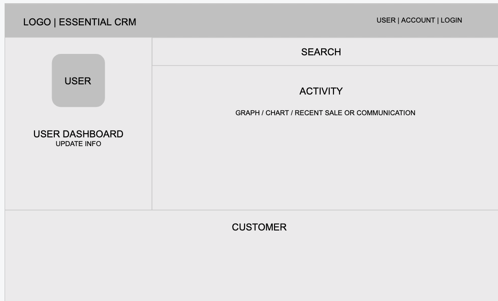
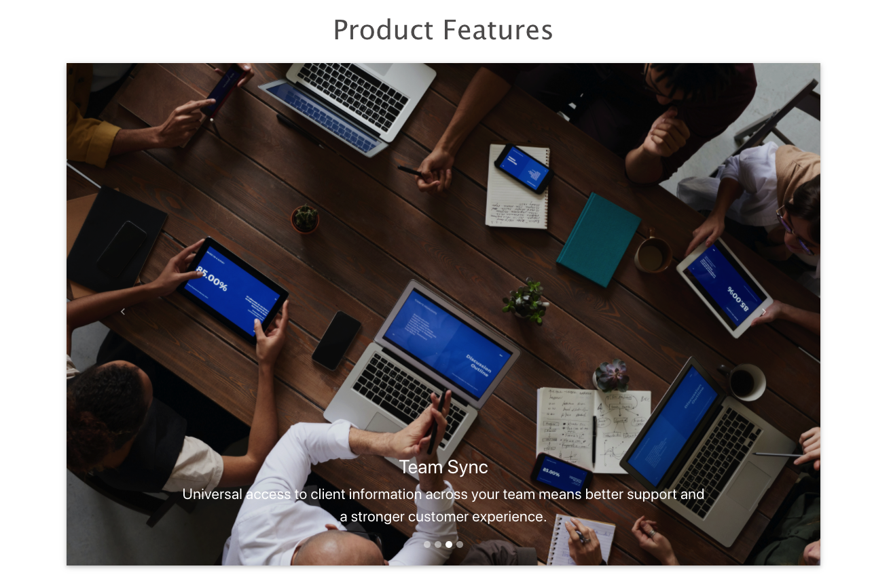
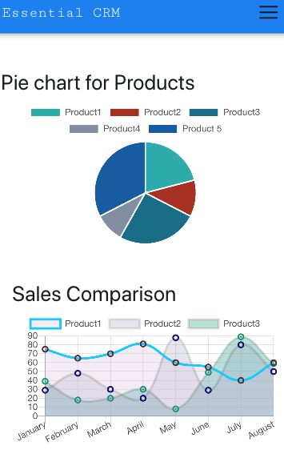

# EssentialCRM

##
**_Project Description_**

essentialCRM is a Customer Relationship Management tool designed to provide a simple, no frills way to keep track of communications and transactions with your clients. It will store User account information and Client contact information with communication and transaction records associated to both the purchasing client and the user responsible for the sale.

##
**_Wireframes_**

 

##
**_Example_**

This is what app looks like

 

##
**_MVP_**
##
**_User Stories_**

* As a user, I would be able to search client and user details.

* As a user, I want to see listings of all clients based on search criteria.

* As a user, I want to be able to update client information.

* As a user, I want to be able to update user information.

* As a user, I want to be able to track customers.

* As a user, I want to be able to track sales.

##
**_Post MVP Stretch Goal_**

* As a user, I would like to display an analytics dashboard and and monitor all activities for sales and clients.

### Technologies Used
- React
- React bootstrap
- React Router DOM
- React Chart
- Material UI

## Testing Technologies
- Jest
- Enzymes

##
**_Installation Instructions_**

To set up app locally on your system: 

* Install VsCode locally and ensure it is running.

* Fork and clone this repository

* Change into new directory and open file into VsCode

* Install npm dependencies

* Run the application with npm start

##
**_Contribute_**

Source code: https://github.com/statst/Group-Project-CRM-frontend

Find our services on: https://essentialcrm323.herokuapp.com/

# Contributor Team
- Foolan Bhosale - https://www.linkedin.com/in/foolan-bhosale
- Jyoti Shinde - https://www.linkedin.com/in/jyoti-shinde/
- TK Nguyen - https://www.linkedin.com/in/tuongknguyen/
- Rory Ellis - https://www.linkedin.com/in/roryellis/

# Docker Related steps for creating and running this application as a docker container on premise or in the cloud
# Author: Anil Mirge

## Project Setup
### This section is optional if you already have a working React application
Install Create React App globally:

$ npm install -g create-react-app@3.4.1
Generate a new app:

$ npm init react-app sample --use-npm
$ cd sample
Docker
Add a Dockerfile to the project root:

# pull official base image
FROM node:13.12.0-alpine

# set working directory
WORKDIR /app

# add `/app/node_modules/.bin` to $PATH
ENV PATH /app/node_modules/.bin:$PATH

# install app dependencies
COPY package.json ./
COPY package-lock.json ./
RUN npm install --silent
RUN npm install react-scripts@3.4.1 -g --silent

# add app
COPY . ./

# start app
CMD ["npm", "start"]
Silencing the NPM output, via --silent, is a personal choice. It’s often frowned upon, though, since it can swallow errors. Keep this in mind so you don’t waste time debugging.

Add a .dockerignore:

node_modules
build
.dockerignore
Dockerfile
Dockerfile.prod
This will speed up the Docker build process as our local dependencies inside the “node_modules” directory will not be sent to the Docker daemon.

Build and tag the Docker image:

$ docker build -t sample:dev .
Then, spin up the container once the build is done:

$ docker run \
    -it \
    --rm \
    -v ${PWD}:/app \
    -v /app/node_modules \
    -p 3001:3000 \
    -e CHOKIDAR_USEPOLLING=true \
    sample:dev
If you run into an "ENOENT: no such file or directory, open '/app/package.json". error, you may need to add an additional volume: -v /app/package.json.

What’s happening here?

The docker run command creates and runs a new container instance from the image we just created.
-it starts the container in interactive mode. Why is this necessary? As of version 3.4.1, react-scripts exits after start-up (unless CI mode is specified) which will cause the container to exit. Thus the need for interactive mode.

--rm removes the container and volumes after the container exits.
-v ${PWD}:/app mounts the code into the container at “/app”.

{PWD} may not work on Windows. See this Stack Overflow question for more info.

Since we want to use the container version of the “node_modules” folder, we configured another volume: -v /app/node_modules. You should now be able to remove the local “node_modules” flavor.
-p 3001:3000 exposes port 3000 to other Docker containers on the same network (for inter-container communication) and port 3001 to the host.

For more, review this Stack Overflow question.

Finally, -e CHOKIDAR_USEPOLLING=true enables a polling mechanism via chokidar (which wraps fs.watch, fs.watchFile, and fsevents) so that hot-reloading will work.
Open your browser to http://localhost:3001/ and you should see the app. Try making a change to the App component within your code editor. You should see the app hot-reload. Kill the server once done.

What happens when you add d to ` -it`?

$ docker run \
    -itd \
    --rm \
    -v ${PWD}:/app \
    -v /app/node_modules \
    -p 3001:3000 \
    -e CHOKIDAR_USEPOLLING=true \
    sample:dev
Check your understanding and look this up on your own.

Want to use Docker Compose? Add a docker-compose.yml file to the project root:

version: '3.7'

services:

  sample:
    container_name: sample
    build:
      context: .
      dockerfile: Dockerfile
    volumes:
      - '.:/app'
      - '/app/node_modules'
    ports:
      - 3001:3000
    environment:
      - CHOKIDAR_USEPOLLING=true
Take note of the volumes. Without the anonymous volume ('/app/node_modules'), the node_modules directory would be overwritten by the mounting of the host directory at runtime. In other words, this would happen:

Build - The node_modules directory is created in the image.
Run - The current directory is mounted into the container, overwriting the node_modules that were installed during the build.
Build the image and fire up the container:

$ docker-compose up -d --build
Ensure the app is running in the browser and test hot-reloading again. Bring down the container before moving on:

$ docker-compose stop
Windows Users: Having problems getting the volumes to work properly? Review the following resources:

Docker on Windows–Mounting Host Directories
Configuring Docker for Windows Shared Drives
You also may need to add COMPOSE_CONVERT_WINDOWS_PATHS=1 to the environment portion of your Docker Compose file. Review the Declare default environment variables in file guide for more info.

Production
Let’s create a separate Dockerfile for use in production called Dockerfile.prod:

# build environment
FROM node:13.12.0-alpine as build
WORKDIR /app
ENV PATH /app/node_modules/.bin:$PATH
COPY package.json ./
COPY package-lock.json ./
RUN npm ci --silent
RUN npm install react-scripts@3.4.1 -g --silent
COPY . ./
RUN npm run build

# production environment
FROM nginx:stable-alpine
COPY --from=build /app/build /usr/share/nginx/html
EXPOSE 80
CMD ["nginx", "-g", "daemon off;"]
Here, we take advantage of the multistage build pattern to create a temporary image used for building the artifact – the production-ready React static files – that is then copied over to the production image. The temporary build image is discarded along with the original files and folders associated with the image. This produces a lean, production-ready image.

Check out the Builder pattern vs. Multi-stage builds in Docker blog post for more info on multistage builds.

Using the production Dockerfile, build and tag the Docker image:

$ docker build -f Dockerfile.prod -t sample:prod .
Spin up the container:

$ docker run -it --rm -p 1337:80 sample:prod
Navigate to http://localhost:1337/ in your browser to view the app.

Test with a new Docker Compose file as well called docker-compose.prod.yml:

version: '3.7'

services:

  sample-prod:
    container_name: sample-prod
    build:
      context: .
      dockerfile: Dockerfile.prod
    ports:
      - '1337:80'
Fire up the container:

$ docker-compose -f docker-compose.prod.yml up -d --build
Test it out once more in your browser.

React Router and Nginx
If you’re using React Router, then you’ll need to change the default Nginx config at build time:

COPY --from=build /app/build /usr/share/nginx/html
Add the change to Dockerfile.prod:

# build environment
FROM node:13.12.0-alpine as build
WORKDIR /app
ENV PATH /app/node_modules/.bin:$PATH
COPY package.json ./
COPY package-lock.json ./
RUN npm ci --silent
RUN npm install react-scripts@3.4.1 -g --silent
COPY . ./
RUN npm run build

# production environment
FROM nginx:stable-alpine
COPY --from=build /app/build /usr/share/nginx/html
# new
COPY nginx/nginx.conf /etc/nginx/conf.d/default.conf
EXPOSE 80
CMD ["nginx", "-g", "daemon off;"]
Create the following folder along with a nginx.conf file:

└── nginx
    └── nginx.conf
nginx.conf:

server {

  listen 80;

  location / {
    root   /usr/share/nginx/html;
    index  index.html index.htm;
    try_files $uri $uri/ /index.html;
  }

  error_page   500 502 503 504  /50x.html;

  location = /50x.html {
    root   /usr/share/nginx/html;
  }

}
Next Steps
With that, you should now be able to add React to a larger Docker-powered project for both development and production environments. If you’d like to learn more about working with React and Docker along with building and testing microservices, check out the Microservices with Docker, Flask, and React course bundle at TestDriven.io.